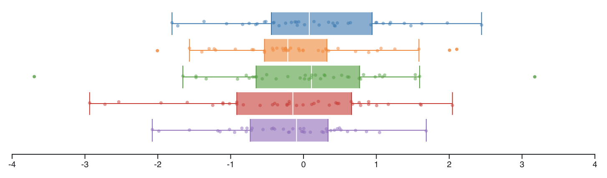
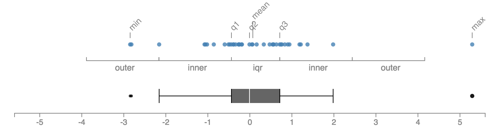

# d3-boxplot

d3js plugin for box-and-whisker plot.

## Installing

If you use NPM, `npm install d3-boxplot`. Otherwise, download the
[latest release](https://github.com/akngs/d3-boxplot/releases/latest).

## Usage

Here's a minimal code snippet:

    
    

    

Visit [this page](https://beta.observablehq.com/@akngs/d3-boxplot) to see more examples.

## API Reference

<a href="#boxplot" name="boxplot">#</a> d3.<b>boxplot</b>()

Constructs a new box plot generator with the default settings.

<a href="#boxplotStats" name="boxplotStats">#</a> d3.<b>boxplotStats</b>(data, [*accessor*])

Calculates descriptive statistics such as five-number summeries, IQR, and inner/outer fences of
given **sorted** array `data`. If the type of elements in `data` is not a number, you should
provide an *accessor* function as the second argument and the array should be sorted according to
the *accessor*.

If you have multiple batches of data, you may use `Array.map()` to turn them into box plot
statistics:

    var batches = [
      [1,2,3,4,5],
      [6,7,8,9,10]
    ];
    var stats = batches.map(function(b) {return d3.boxplotStats(b);});

Now you can draw small-multiples of box plots using conventional d3 code:

    d3.select('svg').selectAll('g.plot').data(stats)
      .join('g')
      .attr('transform', function(d, i) {return 'translate(...)';})
      .call(d3.boxplot())

Box plot statistics are also useful to render additional annotations on top of a box plot, like
this:

Visit [Box plot explained](https://beta.observablehq.com/@akngs/box-plot-explained) to see the code.

<a href="#boxplot_vertical" name="boxplot_vertical">#</a> boxplot.<b>vertical</b>([*vertical*])

If *vertical* is specified, sets the vertical mode. If *vertical* is not specified, returns the
current vertical mode. The default value is `false`.

<a href="#boxplot_scale" name="boxplot_scale">#</a> boxplot.<b>scale</b>([*scale*])

If *scale* is specified, sets the scale. If *scale* is not specified, returns the current scale.
The default value is `d3.scaleLinear()` instance with default values.

<a href="#boxplot_bandwidth" name="boxplot_bandwidth">#</a> boxplot.<b>bandwidth</b>([*bandwidth*])

If *bandwidth* is specified, sets the bandwidth of the plot. Bandwidth is a pixel value specifying
a thickness of the plot. If *bandwidth* is not specified, returns the current bandwidth. The
default value is `20`.

<a href="#boxplot_showInnerDots" name="boxplot_showInnerDots">#</a> boxplot.<b>showInnerDots</b>([*flag*])

If *flag* is specified, sets the option. Set it `true` to show all data dots, or `false` to show
only outliers (and far-outs).Bandwidthis a pixel value specifying If *flag* is not specified,
returns the current value. The default value is `true`.

<a href="#boxplot_jitter" name="boxplot_jitter">#</a> boxplot.<b>jitter</b>([*jitter*])

If *jitter* is specified, sets the jittering mode. If *jitter* is not specified, returns the
current jittering mode. The default value is `true`.
