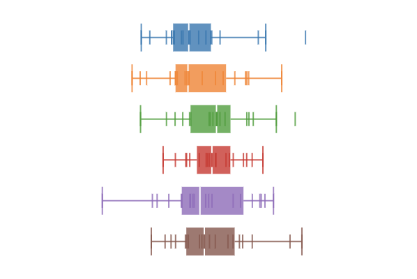

# d3-boxplot

d3js plugin for box-and-whisker plot.


## Installing

If you use NPM, `npm install d3-boxplot`. Otherwise, download the
[latest release](https://github.com/akngs/d3-boxplot/releases/latest).

## Usage

Here's a minimal code snippet:

```javascript
let data = [1, 2, 3, 4, 5]
let stats = d3.boxplotStats(data)
let x = d3.scaleLinear()
  .domain(d3.extent(data))
  .range([0, 300])
let plot = d3.boxplot().scale(x)
d3.select('svg').datum(stats).call(plot)
```

Visit [this page](https://beta.observablehq.com/@akngs/d3-boxplot) to see more examples.

## API Reference

<a href="#boxplot" name="boxplot">#</a> d3.<b>boxplot</b>()

Constructs a new box plot generator with the default settings.

<a href="#boxplotStats" name="boxplotStats">#</a> d3.<b>boxplotStats</b>(data, [*accessor*])

Calculates descriptive statistics such as five-number summeries, IQR, and inner/outer fences of
given **sorted** array `data`. If the type of elements in `data` is not a number, you should
provide an *accessor* function as the second argument and the array should be sorted according to
the *accessor*.

If you have multiple batches of data, you may use `Array.map()` to turn them into box plot
statistics:

```javascript
let batches = [
  [1,2,3,4,5],
  [6,7,8,9,10]
]
let stats = batches.map(function(b) {return d3.boxplotStats(b)})
```

Now you can draw small-multiples of box plots using conventional d3 code:

```javascript
d3.select('svg').selectAll('g.plot').data(stats)
  .join('g')
  .attr('transform', function(d, i) {return 'translate(...)'})
  .call(d3.boxplot())
```

Box plot statistics are also useful to render additional annotations on top of a box plot, like
this:


Visit [Box plot explained](https://beta.observablehq.com/@akngs/box-plot-explained) to see the code.

<a href="#boxplot_vertical" name="boxplot_vertical">#</a> boxplot.<b>vertical</b>([*vertical*])

Sets or returns *vertical* mode. The default value is `false` which means a horizontal mode.

<a href="#boxplot_scale" name="boxplot_scale">#</a> boxplot.<b>scale</b>([*scale*])

Sets or returns *scale*. The default value is `d3.scaleLinear()` instance with domain `[0, 1]`, and
range `[0, 1]`.

<a href="#boxplot_bandwidth" name="boxplot_bandwidth">#</a> boxplot.<b>bandwidth</b>([*bandwidth*])

Sets or returns *bandwidth*. Bandwidth is a pixel value specifying a thickness of the plot. The
default value is `20`.

<a href="#boxplot_boxwidth" name="boxplot_boxwidth">#</a> boxplot.<b>boxwidth</b>([*boxwidth*])

Sets or returns *boxwidth*. Boxwidth is a pixel value specifying a thickness of the IQR box. The
default value is `20`. By setting this value to 3 and hide inner dots by call
`showInnerDots(false)`, you can render minimalistic box plots mimic Edward Tufte's style:


<a href="#boxplot_showInnerDots" name="boxplot_showInnerDots">#</a> boxplot.<b>showInnerDots</b>([*flag*])

Sets or returns *showInnerDots flag*. Set it `true` to show all data dots, or `false` to show
only outliers (and far-outs). The default value is `true`.

<a href="#boxplot_symbol" name="boxplot_symbol">#</a> boxplot.<b>symbol</b>([*symbol*])

Sets or returns *symbol*. The default value is `boxplotSymbolDot`. The following list shows possible
options:

* `boxplotSymbolDot`
* `boxplotSymbolTick`

`boxplotSymbolTick` renders thin lines instead of small circles:



<a href="#boxplot_opacity" name="boxplot_opacity">#</a> boxplot.<b>opacity</b>([*opacity*])

Sets of returns *opacity*. The default value is `0.8`. Partial transparency helps you to reveal
dots under the box.

<a href="#boxplot_jitter" name="boxplot_jitter">#</a> boxplot.<b>jitter</b>([*jitter*])

Sets or returns *jitter*ing value. Actual value used is *bandwidth * jitter*. Set the value `0.0`
to disable jittering. The default value is `0.5`. Please note that the jittering only works with
`symbol(boxplotSymbolTick)`.

<a href="#boxplot_key" name="boxplot_key">#</a> boxplot.<b>key</b>([*key*])

Sets or returns *key* function for [object constancy](https://bost.ocks.org/mike/constancy/). The
default value is `undefined`.

## Development

To bump version run the followings after commit all changes:

    npm version vx.y.z
    npm publish
